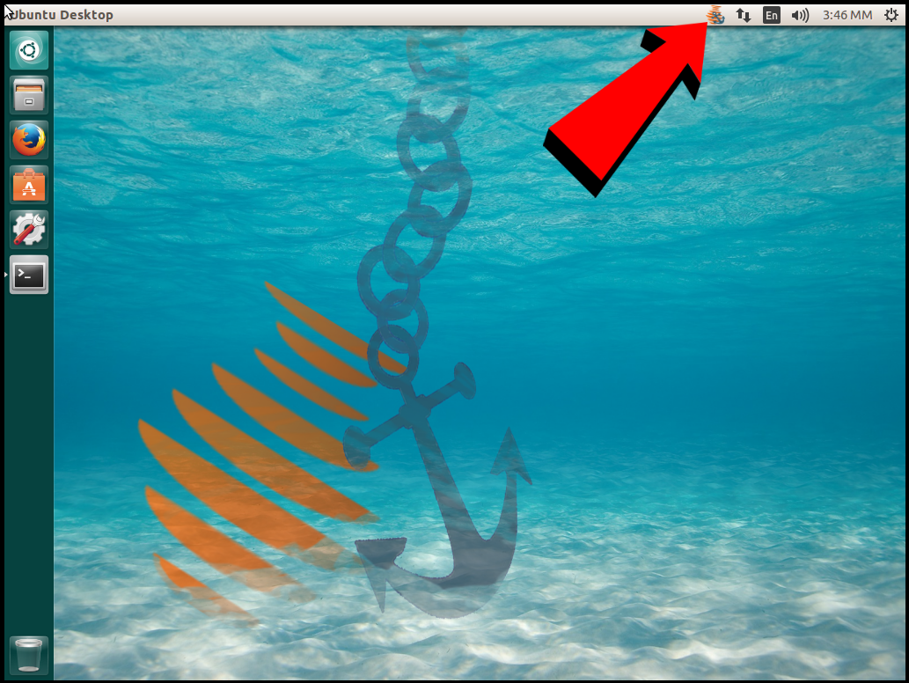

.. _gui:

Graphical User Interface (GUI)
==============================

In this section it is assumed agkyra is installed and properly setup.

* For installation instructions, go to :ref:`installation`.
* For setup instructions, go to :ref:`setup`.

Start up
--------
Click on the agkyra application icon or execute `agkyra` from the command
line. After launch, an agkyra icon will appear on the system tray of your
desktop.

If it is a vanilla installation or some essential settings are missing, a
`Settings` pop up window will appear. Provide the `URL`, `token`, `container`
and `directory` information and press ``Save``.

Otherwise, if the settings have been provided in a previous session and are
sane and functional, agkyra will start running (syncing by default).

Menu
----

Click on the tray icon to open the agkyra menu. Usually a right click is
required, but in some systems you have to left-click instead.

The first line of the menu will provide information on the status of the
application, i.e. if it is ``initializing``, ``syncing``, ``pausing``,
``paused`` or ``stopped`` due to an error.

Click the next button to ``Start syncing`` or ``Pause syncing`` (the title
changes according to the status).

Click ``Open local folder`` to check the contents of the local directory, and
``Launch Pithos+ Page`` to open your Pithos+ account in the default browser.

.. note:: Browser authentication is independent to agkyra and vice versa,
    therefore separate authentication is required.

Click the ``Settings`` window to check and update the back-end and GUI settings

The ``About`` button will display general information (e.g., the license).

Click the ``Quit Agkyra`` button to shutdown the back-end and exit the GUI.

Notifications
-------------

Every time the status of the application changes, a temporary notification
window will inform the Desktop user about the change, i.e. a status
change or an error.

There are two types of critical errors that are handled by a dialog:

* when the local directory is deleted (not just emptied)
* when the remote container is deleted (not just emptied)

In the above cases, a pop up dialog informs the user about the incident and
suggest a reset of the application, resulting in creating the deleted end and
filling it up with the contents of the existing end. The user can discard the
suggestion and solve the problem manually.

.. _guivscli:

GUI and CLI in parallel
-----------------------

By design, only one back-end and one GUI session are allowed. This restriction
does not apply on the CLI commands.

If the GUI is launched first, it launches a back-end daemon. Then the user can
manage the application through both the GUI and the CLI.

If the CLI launches the daemon first, the back-end daemon runs **without** a
GUI (the daemon does the actual syncing). If a GUI is launched afterwards, it
will be attached on the running daemon.

If a GUI is already launched and the user attempts to launch a second GUI, the
latter will fail.

All changes made from one client (GUI or CLI) are propagated to the others,
e.g. if agkyra is paused through the CLI, this will be shown on the GUI too
(a notification window will inform the user).

.. warning:: If agkyra is shut down through the GUI, the back-end will also be
    shutdown, even if it was originally started from CLI

.. warning:: If agkyra is shutdown through the CLI, the GUI will also be
    shutdown, even if the session was originally started as a GUI application
